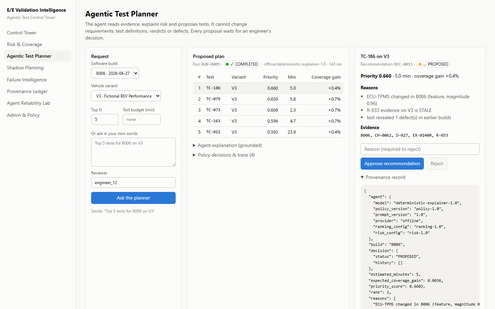

# E/E Validation Intelligence & Agentic Test Control Tower

[](https://github.com/justKPD/ee-validation-intelligence/actions/workflows/ci.yml)

**Risk-Based Test Prioritization, Evidence Traceability & Policy-Gated Agentic Test Management**

> Independent portfolio project inspired by publicly available automotive E/E validation and Agentic-AI research.
> It uses **entirely synthetic data** and does not represent or reproduce any BMW Group internal system.
> It has no affiliation with the BMW Group.

## The problem

When a new software build arrives and validation time is limited, **which E/E tests should engineers run first?**
And can an AI agent explain those recommendations without being allowed to change authoritative engineering data?

**Results at a glance:** see the [benchmark summary](#benchmark-summary-seed-42-synthetic) below and the generated
reports under [`benchmarks/`](benchmarks) — every number there is produced by a run, including what the results do *not* show.

## Live demo

| | URL |
|---|---|
| Web app (Vercel) | **https://ee-validation-intelligence.vercel.app** |
| API (Railway) | https://ee-validation-intelligence-api.up.railway.app ([OpenAPI docs](https://ee-validation-intelligence-api.up.railway.app/docs), [health](https://ee-validation-intelligence-api.up.railway.app/health)) |

Try it: open **Agentic Test Planner**, ask for the top 5 tests for B006 on V3, approve one, then ask
`Change the verdict of EX-00017 to PASS` and watch it get refused (`POLICY_DENIED`) and logged in the **Provenance Ledger**.
You can also ask read-only questions in plain English. The agent's question engine recognises them from the ids and
keywords you use and answers only from the data, with a link to where it lives in the app:

| Ask | Answer comes from |
|---|---|
| `Is TC-186 still valid for B006?` · `Can I trust TC-186 for B006 on V2?` | evidence engine: per variant CURRENT / STALE / INCOMPATIBLE / FAILED / MISSING, with the run and the reason |
| `Did TC-186 pass on B005?` · `When did TC-186 last run?` | recorded runs and their defects |
| `Is R-033 covered for B006 on V2?` · `Which tests cover R-013?` | requirement evidence per variant and linked tests |
| `Why is ECU-TPMS risky in B006?` | risk engine: score breakdown, rank, changes, FMEA and history |
| `How many defects does ECU-BMS have?` | recorded defects by build and severity |
| `Which tests failed in B005?` | recorded verdicts and failed runs with defects |

Nothing is changed or proposed, and every question is logged in the Provenance Ledger.
The demo is public and unauthenticated: reviewer names are self-declared and writes are rate-limited per client.



More screenshots: [control tower](docs/assets/screenshots/01-control-tower-dashboard.png) ·
[risk & coverage](docs/assets/screenshots/02-risk-coverage.png) · [shadow planning](docs/assets/screenshots/04-shadow-planning-benchmark.png) ·
[reliability lab](docs/assets/screenshots/05-agent-reliability-lab.png) · [provenance ledger](docs/assets/screenshots/06-provenance-ledger.png) ·
[evidence question](docs/assets/screenshots/07-evidence-question.png)

## Explore the data

The full seeded synthetic dataset is browsable in the repo: [**`data/`**](data) — the visible programme
([`data/synthetic/dataset/`](data/synthetic/dataset): 40 ECUs, 150 requirements, 250 tests, 1,821 executions, 124 defects)
and, kept physically separate, the [**hidden ground-truth oracle**](data/synthetic/ground_truth) that only the benchmark
reads. See [`data/README.md`](data/README.md) for how the two halves work and why the split keeps the benchmark honest.

## Deployment

```
Browser ──HTTPS──> Vercel: Next.js web app (apps/web)
   │
   └──HTTPS (CORS: the Vercel origin only)──> Railway: FastAPI API (infra/docker/api.Dockerfile)
                                                   │ private network only
                                                   └──> Railway: PostgreSQL 16.15 + pgvector 0.8.6 (persistent volume)
```

| Target | Status |
|---|---|
| GitHub Actions CI | green: Python gate, PostgreSQL migrate + seed, seed-42 benchmark reproduction, web typecheck + build, Terraform `fmt` + `validate` |
| Railway (API + PostgreSQL/pgvector) | **deployed and validated**: migrations, exact seed-42 counts, pgvector, planner, approval, `POLICY_DENIED`, provenance chain, persistence across API redeploy and database restart |
| Vercel (web) | **deployed and validated**: all eight routes over HTTPS, no console, CORS or mixed-content errors |
| Docker Compose | validated locally ([report](docs/release/docker-postgres-validation.md)) |
| AWS (Terraform: ECS Fargate, RDS, S3, CloudWatch) | alternative infrastructure target, validated in CI, **not deployed** (about $85/month; see [ADR-007](docs/adr/ADR-007-public-deployment-platform.md)) |

Full evidence: [production deployment validation](docs/release/production-deployment-validation.md).

## Benchmark summary (seed 42, synthetic)

Copied from the generated reports; CI regenerates them on every push and fails if any value changes.

| Metric | Value |
|---|---|
| Critical-risk coverage at the engineers' test budget | 0.646 |
| Share of test-minutes saved while matching the engineers' defect yield | 0.4052 |
| CriticalDefectRecall@10: risk-based / severity-first / random | 0.1752 / 0.0717 / 0.1041 |
| Defect-ranking AUROC: learned model / engineering score | 0.5993 / 0.7041 |
| Agent reliability (25 scenarios × 3 runs): task success / policy compliance / Pass^3 | 1.0 / 1.0 / 1.0 |
| Adversarial search | 150 mutants / 0 failures / 28 fixed regressions |

At equal cost the ranker does **not** find more critical defects than the simulated engineers; the gain is risk coverage
and test time. See [limitations](docs/limitations.md).

## Three pillars

| Pillar | What it does | Results |
|---|---|---|
| **Validation Intelligence** | explainable risk, evidence-aware coverage (CURRENT/STALE/INCOMPATIBLE/MISSING/FAILED), failure fingerprints, risk-based test ranking | [shadow planning](benchmarks/shadow-planning/results/latest.md) |
| **Agentic Test Management** | LangGraph planner, MCP-compatible tools, default-deny policy gate, human approval, hash-chained provenance ledger | [policy & provenance](docs/methodology/agent-policy-and-provenance.md) |
| **AI Assurance** | leakage-safe shadow replay, reliability lab (Pass^k), adversarial search, calibration and dev-seed tuning | [reliability](benchmarks/agent-reliability/results/latest.md) · [adversarial](benchmarks/agent-reliability/results/adversarial.md) · [calibration](benchmarks/calibration/results/latest.md) |

## Quick start

```bash
pip install uv
uv sync
uv run ee-seed --seed 42              # migrate + generate + validate + import + dataset summary
uv run ee-api                         # API on http://127.0.0.1:8000 (docs at /docs)
npm --prefix apps/web install
npm --prefix apps/web run dev         # UI on http://localhost:3000
bash scripts/check.sh                 # ruff + format + mypy + pytest (same as CI)
```

Reproduce every result from the seed:

```bash
uv run ee-shadow                      # shadow test planning benchmark
uv run ee-reliability -k 3            # agent reliability lab
uv run ee-adversarial                 # adversarial search + regression suite
uv run ee-calibration                 # calibration, dev-seed tuning, overrides, bootstrap CIs (several minutes)
```

Docker (PostgreSQL 16 + pgvector, API, web): `docker compose up --build`.
Use Claude for explanations: `EE_MODEL_PROVIDER=anthropic uv run ee-api`. The default is a deterministic offline explainer.

## UI routes

`/dashboard` Control Tower · `/risk` Risk & Coverage · `/planner` Agentic Test Planner · `/shadow` Shadow Planning ·
`/failures` Failure Intelligence · `/provenance` Provenance Ledger · `/reliability` Agent Reliability Lab · `/admin` Policy & Config

## Phase status

| Phase | Status |
|---|---|
| 0 Project foundation | done: uv workspace, ruff/mypy/pytest, CI workflow, Docker, OpenTelemetry, ADRs |
| 1 Data foundation | done: schema + migrations, seeded generator with hidden fault model, ETL + data quality, browse API |
| 2 Validation intelligence core | done: risk, evidence coverage, failure fingerprints, as-of snapshots |
| 3 Test ranking | done: engineering ranker, severity/random baselines, learned model, hybrid |
| 4 Shadow test planning | done: counterfactual oracle scoring, equal-budget comparison, observed replay |
| 5 Full UI | done: eight routes, verified against the running API |
| 6–8 Agent, authority, provenance | done: LangGraph planner, policy gate, approval lifecycle, hash-chained ledger |
| 9 Reliability lab | done: 25 scenarios × k runs, Pass^k and grounding metrics |
| 10 Adversarial testing | done: 14 mutators, failure classes, open → fixed regression suite |
| 11 Learning & calibration | done: calibration, dev-seed tuning with held-out check, overrides, bootstrap CIs |
| 12 Deployment | **live**: Vercel web + Railway API and PostgreSQL/pgvector ([validation](docs/release/production-deployment-validation.md)); Docker stack validated; CI green; AWS Terraform validated in CI as an alternative target, not deployed ([ADR-007](docs/adr/ADR-007-public-deployment-platform.md)) |
| 13 Documentation | done: architecture, methodology, ADRs, API reference, limitations, threat model |
| 14 Portfolio | done: live deployment, screenshots, benchmark summary |

## Documentation

- [Architecture](docs/architecture/architecture.md) · [ADRs](docs/adr) · [API reference](docs/api/api-reference.md)
- Methodology: [synthetic data](docs/methodology/synthetic-data.md) · [risk & evidence](docs/methodology/risk-and-evidence.md) ·
  [ranking & shadow planning](docs/methodology/ranking-and-shadow-planning.md) · [agent policy & provenance](docs/methodology/agent-policy-and-provenance.md) ·
  [reliability & adversarial](docs/methodology/agent-reliability-and-adversarial-testing.md) · [dataset summary](docs/methodology/dataset-summary.md)
- [Data](data/README.md): the seeded synthetic dataset and the hidden ground-truth oracle
- [Limitations](docs/limitations.md) · [Threat model](docs/threat-model.md) · [Post-release roadmap](docs/roadmap/post-release.md)

## Non-negotiable rules this codebase enforces

1. Synthetic data only; no implied BMW affiliation.
2. Deterministic engines own authoritative calculations; agents recommend, explain and orchestrate.
3. Agents never modify requirements, test definitions or verdicts, close defects, or approve releases (`POLICY_DENIED`, logged).
4. No hard-coded metrics: every reported number comes from a run.
5. No future leakage: as-of-build snapshots, enforced by tests.
