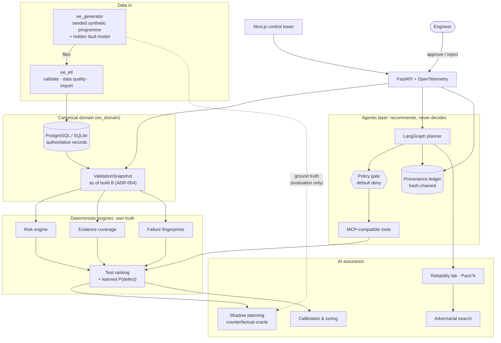
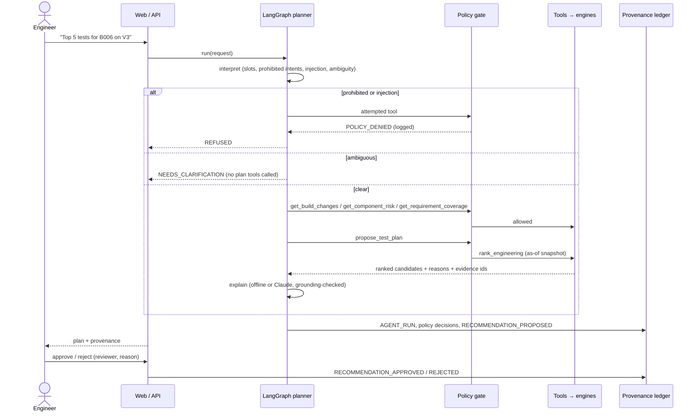

# Architecture

*E/E Validation Intelligence & Agentic Test Control Tower*, an independent portfolio platform on fictional synthetic data.

## Three pillars

| Pillar | Question it answers | Packages |
|---|---|---|
| **Validation Intelligence** | What is risky, and what evidence is still valid? | `ee_risk`, `ee_coverage`, `ee_failures`, `ee_ranking` |
| **Agentic Test Management** | Can an agent plan and explain tests without authority over engineering truth? | `ee_agent`, `ee_policies`, `ee_provenance` |
| **AI Assurance** | Is any of this good, and does the agent behave reliably? | `ee_evaluation` (shadow planning, reliability lab, adversarial search, calibration) |

## Layers

Dependencies point downward only. The ranking package never imports ground truth or the evaluation
package; a test scans its source to enforce this.

## Planner request flow

## Key decisions

| ADR | Decision |
|---|---|
| [001](../adr/ADR-001-architecture.md) | uv-workspace monorepo, strictly layered packages |
| [002](../adr/ADR-002-authority-boundary.md) | deterministic engines own truth; agents never write authoritative data |
| [003](../adr/ADR-003-technology-stack.md) | job-description-aligned stack |
| [004](../adr/ADR-004-as-of-snapshots.md) | as-of-build snapshots make leakage structurally impossible |
| [005](../adr/ADR-005-counterfactual-shadow-evaluation.md) | counterfactual oracle scoring plus oracle-free observed replay |
| [006](../adr/ADR-006-agent-runtime.md) | deterministic planning, LLM-written explanation, provider-agnostic adapter |

## Runtime

| Environment | Composition |
|---|---|
| Local | `uv run ee-seed`, `uv run ee-api` (SQLite), `npm --prefix apps/web run dev` |
| Docker | `docker compose up`: Postgres 16 + pgvector, API, web |
| AWS (authored) | ALB → ECS Fargate (web :80, API :8080), RDS PostgreSQL, S3, CloudWatch, Secrets Manager; see [infra/aws](../../infra/aws/README.md) |

## Package map

| Package | Path | Role |
|---|---|---|
| `ee_domain` | `packages/domain` | ORM models, DTOs, snapshots, visibility, telemetry |
| `ee_generator` | `data/generator` | synthetic programme + hidden fault model |
| `ee_etl` | `packages/etl` | import, data quality, migrations, summary report |
| `ee_risk` | `packages/risk-engine` | component and requirement risk |
| `ee_coverage` | `packages/coverage-engine` | evidence status and coverage |
| `ee_failures` | `packages/failure-intelligence` | failure fingerprint families |
| `ee_ranking` | `packages/ranking` | features, engineering ranker, baselines, learned model, hybrid |
| `ee_policies` | `packages/policies` | policy gate |
| `ee_provenance` | `packages/provenance` | runs, recommendations, approvals, ledger |
| `ee_agent` | `packages/agent-runtime` | interpretation, tools, providers, LangGraph runner |
| `ee_evaluation` | `packages/evaluation` | shadow, reliability, adversarial, calibration |
| `ee_api` | `apps/api` | HTTP composition root |
| web | `apps/web` | Next.js UI |
